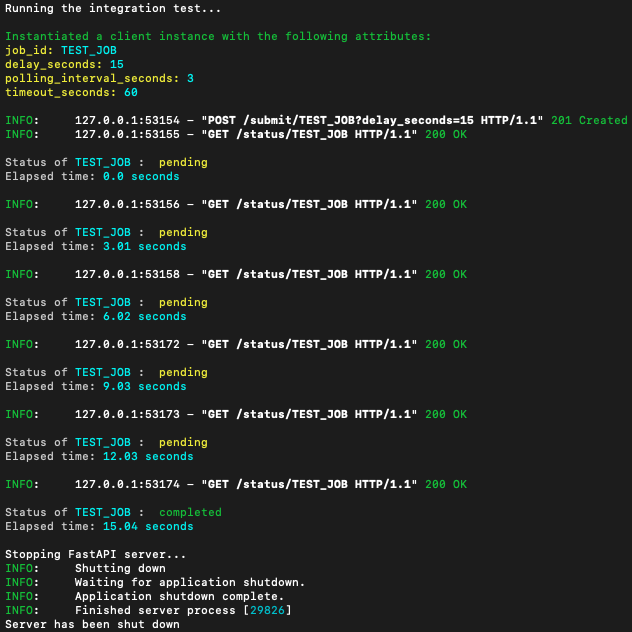

# Heygen Assignment: Client Library for Fetching the Status of a Video Translation Job

## 🌐 Overview

This project contains the implementation details of 2 APIs that simulate the video translation backend. This project also implements an installable python client library that provides the following functionalities:

1. Submitting a (video translation) job.
2. Getting the status of a submitted job.

## 🛠️ Installation

- Run `make install` for creating a virtual environment, activating it, and installing the required dependencies.

## ✨ Usage

### Running the server locally

1. To start the server locally, run:

```bash
uvicorn server.handlers:app --host 127.0.0.1 --port 8000
```

2. Call the `/status` API or the `/submit` API using Postman or by running cURL commands. Example commands:

```bash
cURL --data "delay_seconds=10" http://127.0.0.1:8000/submit/job_000
cURL http://127.0.0.1:8000/status/job_000
```

#### 💡 Note

The APIs are implemented in a way where `20%` of the submitted jobs encounter an error when attempting to process. For such jobs (that encounter an error), we can expect the `/status` API to return `{"result": "error"}`.

## API Signatures

### Base URL

`http://127.0.0.1:8000`

### Endpoints

#### Submit Job

```http
POST /submit/{job_id} HTTP/1.1
Host: http://127.0.0.1
Port: 8000
Authorization: None
```

Example Response:

```
Successfully submitted the job: test_job
```

#### Status

```http
GET /status/{job_id} HTTP/1.1
Host: http://127.0.0.1
Port: 8000
Authorization: None
```

Example Response:

```json
{ "result": "completed" }
```

### API Docs

When the server is running, navigating to `http://127.0.0.1:8000/docs` OR `http://127.0.0.1:8000/redoc` will take you to the API Docs' page, where there's a sandbox for testing the endpoints.

Alternatively, the JSON version of the API Docs can be found [here](openapi.json).

### Using the client library

For detailed information regarding the client library, please refer to its specific [README](client_library/README.md).

1. Make sure that the [server](README.md#running-the-server-locally) is running locally.

2. Import the library:

```python
from translate_video.translate_video import TranslateVideo

# Implementation...
```

3. Create an instance of the `TranslateVideo` class:

```python
video_translation_job = TranslateVideo(
    job_id="TEST_JOB", # ID of the job
    delay_seconds=15, # Attribute indicating the time (seconds) it takes to process the job
    polling_interval_seconds=3, # Seconds between successive calls to the GET /status API
    timeout_seconds=60, # Seconds to wait for the job to process before returning the status of the job
)
```

4. Submit the job:

```python
video_translation_job.submit()
```

5. Get the status of the job:

```python
status = video_translation_job.get_status() # Will run until the job is completed or the timeout seconds has elapsed
print(status) # {"result": "completed"}
```

## Running the integration test

[Given how the APIs are implemented](README.md#💡-note), running the below command might result in the job's status being `{"result": "error"}` (which is a valid output). In such a scenario, for testing the polling interval, please run the below command once more (to work with the 80% odds of the job not resulting in an error).

```bash
./run_integration_test.sh
```

OR

```bash
make run_integration_test
```

## Expected output of the integration test


